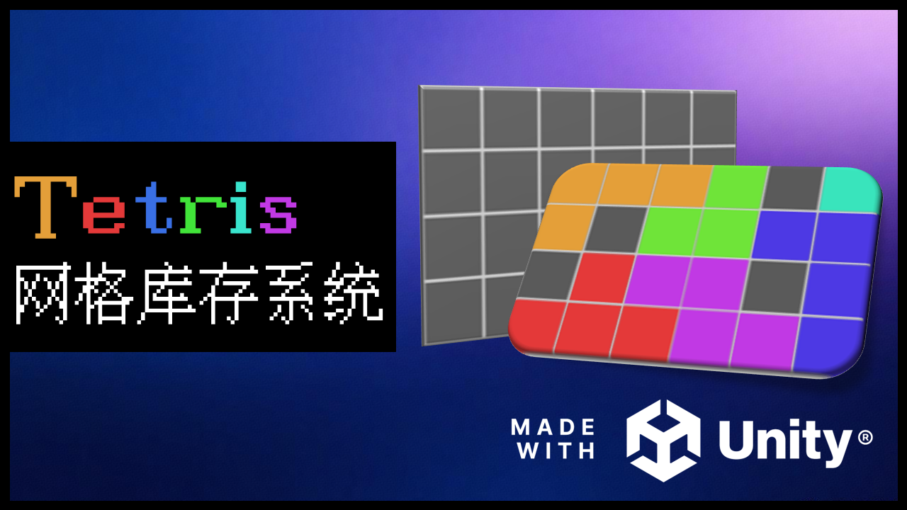
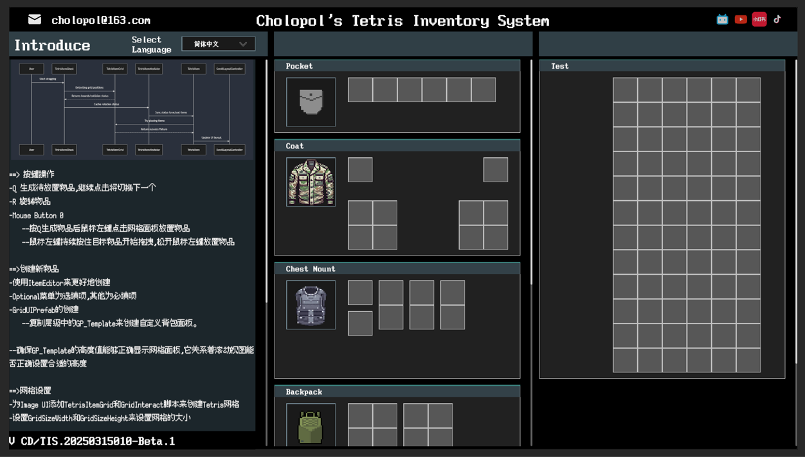

# **Cholopol's Tetris Inventory System**

[](LICENSE) [](STARS)

 
  <center>基于Unity开发的实用的Tetris俄罗斯方块式物品网格库存系统</center>

## 📖 目录
- [🌟 项目概述](#-项目概述)
- [✨ 功能特性](#-功能特性)
  - [核心机制](#核心机制)
  - [交互系统](#交互系统)
  - [交互功能流程](#交互功能流程)
  - [网格设计](#网格设计)
  - [数据管理](#数据管理)
  - [数据-逻辑分离](#数据-逻辑分离)
  - [扩展性](#扩展性)
- [🧩 项目结构](#-项目结构)
- [🚀 环境要求](#-环境要求)
- [🤝 贡献指南](#-贡献指南)
- [📜 许可证](#-许可证)
- [📬 联系方式](#-联系方式)

---

## 🌟 项目概述
> Cholopol's Tetris Inventory System是基于Unity引擎开发的Tetris背包系统，巧妙融合经典俄罗斯方块机制与游戏道具管理需求。该系统专为需要动态空间规划策略的游戏场景设计，适用于RPG装备管理、生存游戏资源存储、策略游戏战利品分配等多样化游戏类型。


---

## ✨ 功能特性

- **核心机制**

  - 俄罗斯方块式物品管理
  - 任意形状支持
    - 支持Domino（2格）、Tromino（3格）、Tetromino（4格）、Pentomino（5格）等经典俄罗斯方块形状，当然你也可以按照自己的想法自定义任何形状！
  - 动态旋转系统
    - 支持0°/90°/180°/270°旋转，自动计算旋转偏移量
  - 碰撞检测
    - 边界检查 (`BoundryCheck`)：防止物品超出网格范围
    - 重叠检测 (`OverlapCheck`)：验证目标位置是否已被占用
  - 自定义网格尺寸

- **交互系统**

  - 可视化拖拽
  - 物品影子 (TetrisItemGhost)  
    - 实时显示拖拽预览，保留旋转状态与尺寸信息
  - 跨容器交互
    - 支持物品在网格背包与装备槽位之间自由转移
  - 槽位类型约束
    - 定义武器/消耗品等9种槽位类型 (`InventorySlotType`)，实现类型匹配验证
  - 实时高亮反馈
    - 使用对象池 (`TilePool`) 动态生成绿色（可放置）/红色（冲突）提示瓦片

- ​**交互功能流程** 

- **网格设计**
  (0,0) 为原点，X轴向右，Y轴向下，请确保所有TetrisItem的坐标均为非负整数

```plaintext
Y
 ▼
 │
0├───(0,0)────(1,0)────(2,0)
 │     │        │        │
1├───(0,1)────(1,1)────(2,1)
 │     │        │        │
2├───(0,2)────(1,2)────(2,2)
 │     │        │        │
 └────────────────────────────▶ X
       0        1        2
```

- **数据管理**

  - 可配置化设计
    - 基于ScriptableObject的物品属性定义
      `ItemDataList_SO`：集中管理物品属性（名称/图标/尺寸等）
      `TetrisItemPointSet_SO`：存储俄罗斯方块形状坐标数据

- **数据-逻辑分离**  
  - 物品属性与形状定义完全解耦，便于扩展新物品类型

- **扩展性**

  - 模块化架构
    - 中介者模式
      `TetrisItemMediator` 统一协调物品与影子的状态同步
    - 单例管理器 
      `InventoryManager` 全局控制物品生成/旋转/高亮逻辑
    - UI动态适配
      `SlotLayoutController` 自动调整槽位UI布局

---
## 🧩 项目结构

```bash
Assets/
└── Scripts/
    ├── Inventory/
    │   ├── Core/
    │   │   ├── TetrisItem.cs          // 背包物品实体
    │   │   ├── TetrisItemGhost.cs     // 背包物品影子
    │   │   ├── TetrisItemMediator.cs  // 背包物品中介者
    │   │   ├── TetrisItemGrid.cs      // 网格逻辑
    │   │   └── InventorySlot.cs       // 装备槽逻辑
    │   ├── Visuals/
    │   │   ├── InventoryHighlight.cs  // 高亮反馈系统
    │   │   └── TilePool.cs            // 高亮瓦片对象池
    │   ├── Data/
    │   │   ├── ItemDataList_SO.cs     // 物品数据配置
    │   │   └── TetrisItemPointSet_SO.cs // 形状数据配置
    │   └── Utilities/
    │       ├── RotationHelper.cs      // 旋转计算工具
    │       └── Singleton.cs           // 单例基类
    └── ItemEditor/                    // Tetris物品编辑器
            └── TetrisItemEditor.cs     // 编辑器脚本
```

---

## 🚀 环境要求

- Unity Editor 2022.3.52f1 LTS及以上
- 多语种支持：通过Unity Package Manager安装`com.unity.localization`插件


---
## 🤝 贡献指南
> 欢迎通过以下方式参与：
- 提交Bug报告或功能请求
- 完善文档或翻译
    - 简体中文
    - 繁體中文
    - English
    - Français
    - 日本語
    - 한국어
    - Русский
    - Español

---
## 📜 许可证
本项目采用 Apache License 2.0 许可证。请参阅 [LICENSE](LICENSE) 文件以获取更多信息。

---
## 📬 联系方式
如果你有任何问题、建议或想法，请随时联系我：
- 📧 电子邮箱：cholopol@163.com
- 💬 社区讨论：敬请期待
- 🌐 视频介绍：敬请期待
- ☕ 赞助我一杯咖啡： [Alipay or WeChat](donate.md)


